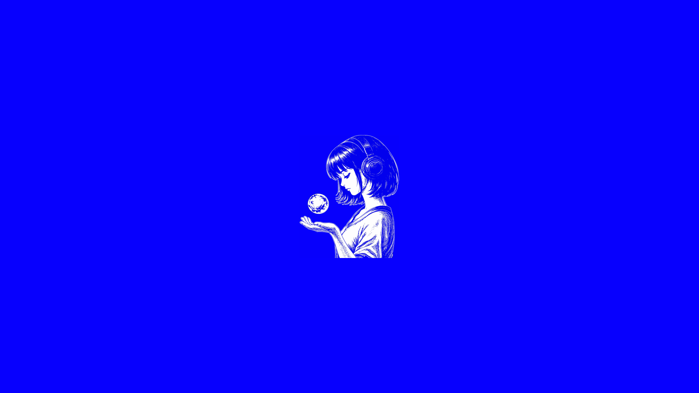

# Hermes Orb Animation for KDE Plasma 6


An unofficial KDE Plasma 6 animated wallpaper plugin based on the rotating orb illustration shown near the bottom of the official Hermes Agent website. It can be selected independently for the Plasma desktop or KDE lock screen.

## Preview



## Features

- black background with blue-and-white Hermes artwork;
- the full illustration is displayed at a maximum height of 338 pixels, matching the combined Parrot + Hermes theme;
- 1284×1590 software-decoded source animation;
- seamless 2.8-second loop;
- self-contained package with no network requests after installation;
- avoids GPU video-decoder artifacts by using Qt Quick `AnimatedImage` playback.

## Requirements

- KDE Plasma 6.0 or later.

## Download

- [KDE Store](https://store.kde.org/p/2366161/)
- [GitHub release v1.0.3](https://github.com/digyear/hermes-orb-lock-animation-kde/releases/tag/v1.0.3)

## Install

```bash
./build.sh
kpackagetool6 --type Plasma/Wallpaper --install dist/hermes-orb-animation-1.0.3.plasmoid
```

To select it directly for the lock screen:

```bash
kwriteconfig6 --file kscreenlockerrc --group Greeter --key WallpaperPlugin io.github.digyear.hermesorb
kbuildsycoca6
```

Test without locking the session:

```bash
/usr/lib/x86_64-linux-gnu/libexec/kscreenlocker_greet --testing
```

Uninstall:

```bash
kpackagetool6 --type Plasma/Wallpaper --remove io.github.digyear.hermesorb
```

## Source and licensing

The Plasma integration code is GPL-3.0-or-later. The original animation is sourced from the official Hermes Agent website and attributed to Nous Research. The artwork is redistributed with permission from Nous Research; see [`CREDITS.md`](CREDITS.md) for attribution details.

This is an unofficial community adaptation and is not an official Nous Research or KDE product.
